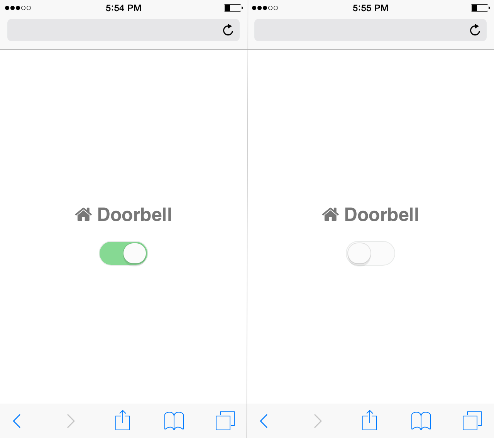
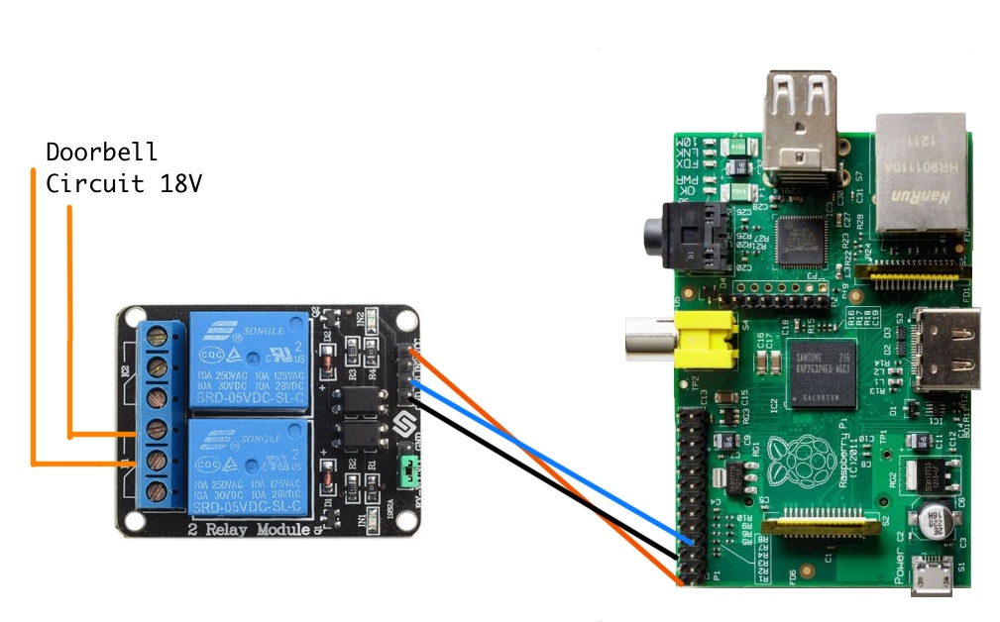

# Naptime Doorbell

Raspberry Pi project to disable a doorbell during naptime.

## Hardware:

+ Raspberry Pi (Model A used for this project but any will work)
+ Jumper wires (female to female type)
+ 5v Relay Module ([this one works](http://www.amazon.com/SunFounder-Channel-Shield-Arduino-Raspberry/dp/B00E0NTPP4/))

## Wiring

+ Connect the 5V Pi pin to the VCC pin of the relay module.
+ Connect the ground pin to the ground pin of the relay.
+ Connect GPIO pin 7 to the IN1 pin of the relay.
+ Connect pins 2 & 3 of the first relay (K1) in series into the doorbell circuit.

## Usage

    git clone git@github.com:watsoncj/naptime-doorbell.git
    cd naptime-doorbell
    sudo ./naptime-doorbell.py
    ./enable-doorbell.py
    ./disable-doorbell.py

    # Run API
    sudo apt-get install python-pip
    sudo pip install -r requirements.txt
    ./api.py

## Start daemon on system startup

Add the following lines to `/etc/rc.local` before the `exit 0` line:

    /home/pi/naptime-doorbell/naptime-doorbell.py &
    /home/pi/naptime-doorbell/api.py &

When done, `/etc/rc.local` should resemble the following:

    #!/bin/sh -e
    #
    # rc.local
    #
    # This script is executed at the end of each multiuser runlevel.
    # Make sure that the script will "exit 0" on success or any other
    # value on error.
    #
    # In order to enable or disable this script just change the execution
    # bits.
    #
    # By default this script does nothing.
    
    # Print the IP address
    _IP=$(hostname -I) || true
    if [ "$_IP" ]; then
      printf "My IP address is %s\n" "$_IP"
    fi
    
    ### This is the line that was added
    /home/pi/naptime-doorbell/naptime-doorbell.py &
    /home/pi/naptime-doorbell/api.py &
    
    exit 0

## Example Crontab:

Schedule the doorbell to be enabled/disabled by editing the crontab. (`crontab -e`)

    # m h  dom mon dow   command
    30 12 * * * /home/pi/naptime-doorbell/disable-doorbell.py
    30 16 * * * /home/pi/naptime-doorbell/enable-doorbell.py

## Date Server:

Since the Pi doesn't have a battery to keep the clock in sync when the power is off, it is important to install ntpdate so the Pi can get it's time from a time server when the network interface comes up.

    sudo apt-get update
    sudo apt-get install ntpdate
