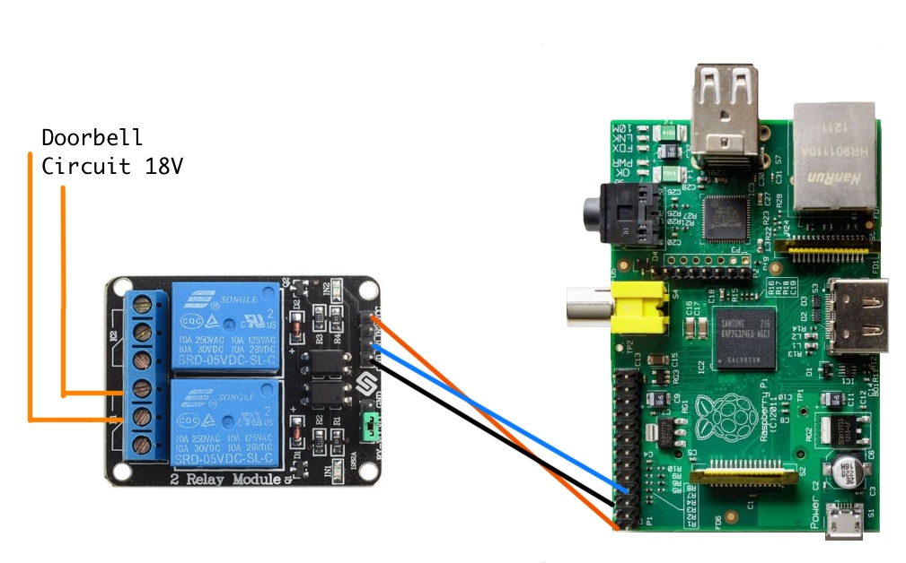

# Naptime Doorbell

Raspberry Pi project to disable a doorbell during naptime.

## Hardware:

+ Raspberry Pi (Model A used for this project but any will work)
+ Jumper wires (female to female type)
+ 5v Relay Module ([this one works](http://www.amazon.com/SunFounder-Channel-Shield-Arduino-Raspberry/dp/B00E0NTPP4/))

## Wiring

+ Connect the 5V Pi pin to the VCC pin of the relay module.
+ Connect the ground pin to the ground pin of the relay.
+ Connect GPIO pin 7 to the IN1 pin of the relay.
+ Connect pins 2 & 3 of the first relay (K1) in series into the doorbell circuit.



## Usage

```
git clone git@github.com:watsoncj/naptime-doorbell.git
screen sudo naptime-doorbell/naptime-doorbell.py
# use ctrl-a ctrl-d to exit
# `screen -r` to re-attach
```

## Example Crontab:

Schedule the doorbell to be enabled/disabled by editing the crontab. (`crontab -e`)

```
# m h  dom mon dow   command
30 12 * * * /home/pi/naptime-doorbell/disable-doorbell.py
30 16 * * * /home/pi/naptime-doorbell/enable-doorbell.py
```

## Date Server:

Since the Pi doesn't have a battery to keep the clock in sync when the power is off, it is important to install ntpdate so the Pi can get it's time from a time server when the network interface is up.

```
sudo apt-get update
sudo apt-get install ntpdate
```
